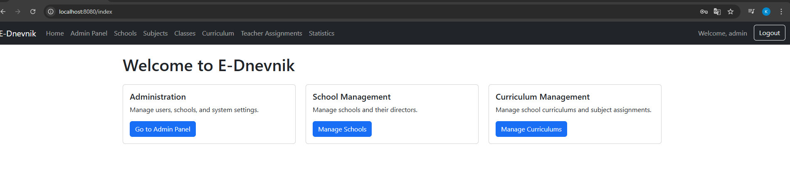
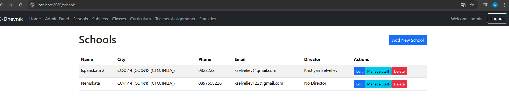
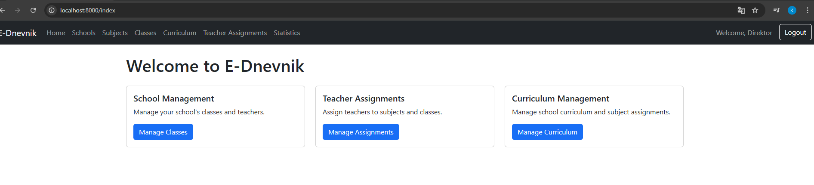
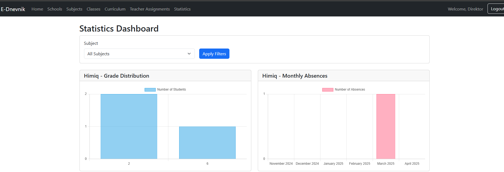
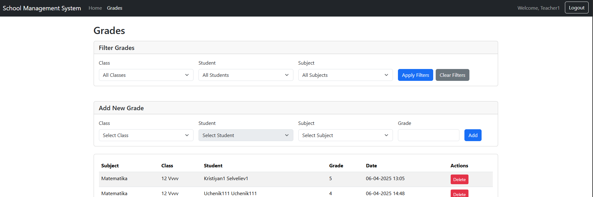
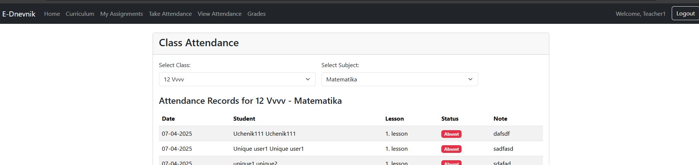
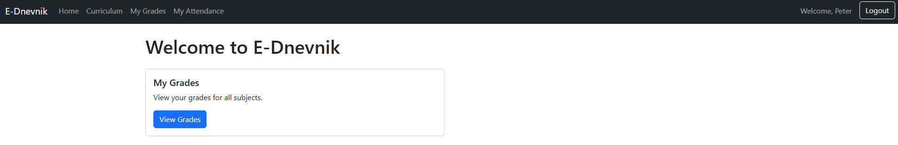
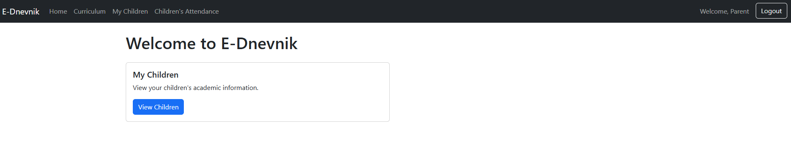

# E-Diary (Dnevnik) Application developed by Kristiyan Selveliev F104135

A comprehensive electronic diary system for schools, providing grade management, attendance tracking, and statistical analysis.

## Screenshots

### Admin Interface
#### User Management

- Create and manage user accounts
- Assign roles and permissions
- Manage school assignments

#### School Management

- Create and configure schools
- Assign directors
- Monitor system-wide statistics

### Director Interface
#### School Dashboard

- Overview of school performance
- Teacher assignments
- Class management

#### Statistics View

- Grade distribution charts
- Attendance analytics
- School-specific reports

### Teacher Interface
#### Grade Management

- Enter and modify grades
- View class performance
- Track student progress

#### Attendance Tracking

- Mark daily attendance
- View attendance history
- Generate reports

### Student Interface
#### Personal Dashboard

- View current grades
- Check attendance record
- Access class schedule

### Parent Interface
#### Children Overview

- View children's grades
- Monitor attendance
- Access schedules

## Features

### User Roles and Access Control
- **Admin**: Full system access and management capabilities
- **Director**: School-specific management and oversight
- **Teacher**: Class and subject management, grade and attendance management
- **Student**: View personal grades and attendance
- **Parent**: Monitor children's academic progress and attendance

### School Management
- Create and manage multiple schools
- Assign directors to schools
- Configure school-specific settings

### Class Management
- Create and organize classes (e.g., 12A, 12B, 12C)
- Assign teachers to classes
- Group students by class
- Grade-based class organization

### Subject Management
- Define and manage subjects
- Assign teachers to subjects
- Create subject-specific curricula

### Teacher Assignment
- Assign teachers to specific subjects and classes
- Manage teacher workload and schedules
- School-specific teacher assignments

### Grade Management
- Record and track student grades
- View grade distribution by subject
- Grade history and trends
- Multiple grade entries per subject

### Attendance Tracking
- Record daily student attendance
- Track absences by subject
- Historical attendance records
- Monthly absence reports

### Curriculum Management
- Create and manage curriculum by grade
- Assign subjects to specific grades
- Schedule management for classes
- Subject-specific curriculum planning

### Statistics and Analytics
- **Grade Distribution**
  - View grade distribution by subject
  - Analyze performance trends
  - School-specific grade analysis

- **Attendance Analytics**
  - 6-month attendance history
  - Monthly absence tracking
  - Subject-wise attendance patterns
  - School-specific attendance reports

### Role-Based Views
#### Admin View
- Access to all schools and data
- System-wide statistics and reports
- User management capabilities
- School management functions

#### Director View
- School-specific data access
- Teacher management
- Class organization
- School performance analytics

#### Teacher View
- Class-specific grade entry
- Attendance management
- Subject-specific views
- Student performance tracking

#### Student View
- Personal grade history
- Attendance record
- Subject-wise performance
- Schedule view

#### Parent View
- View children's grades and performance
- Track children's attendance
- Monitor academic progress
- Access to children's schedules
- Receive notifications about important updates
- View subject-wise performance for each child

## Security Features
- Role-based access control
- Secure authentication
- Data privacy protection
- School-specific data isolation

## Technical Details
- Built with Spring Boot
- Thymeleaf templating engine
- Bootstrap UI framework
- Chart.js for statistics visualization
- JPA/Hibernate for data persistence
- RESTful architecture
- Responsive design

## Getting Started

### Prerequisites
- Java 21 or higher
- PostgreSQL database

### Installation
1. Clone the repository
2. Configure database settings in `application.properties`
3. Start the application with `mvn spring-boot:run`

### Initial Setup
1. Create admin account
2. Set up schools
3. Create user accounts
4. Configure classes and subjects
5. Assign teachers and students

## Usage Guidelines

### For Administrators
- System setup and configuration
- User management
- School creation and management
- System-wide reporting

### For Directors
- School management
- Teacher assignments
- Class organization
- School statistics review

### For Teachers
- Grade entry
- Attendance tracking
- Class management
- Performance reporting

### For Students
- Grade review
- Attendance history
- Schedule viewing

### For Parents
- Monitor children's academic performance
- Track attendance records
- View class schedules
- Access grade history
- Review subject-specific progress
- Stay informed about school activities